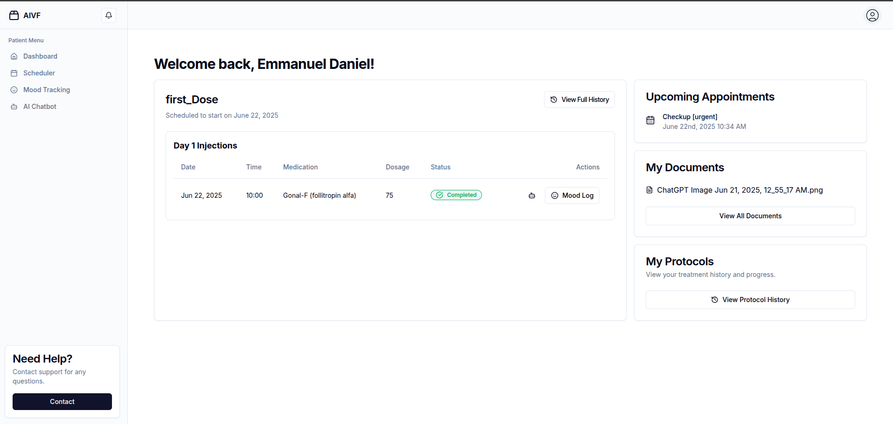
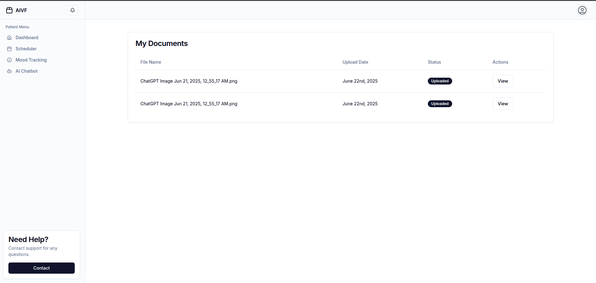
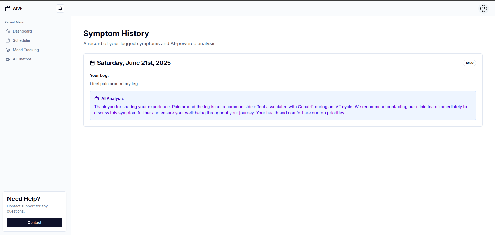
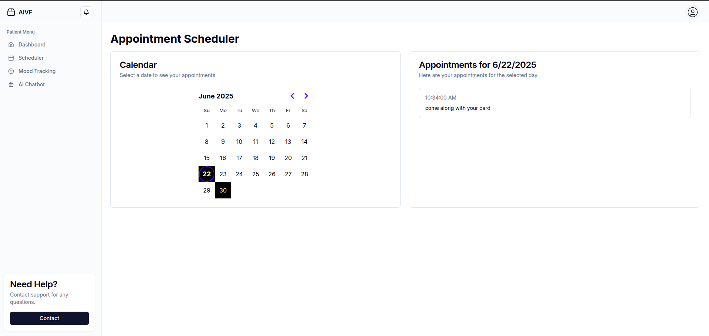
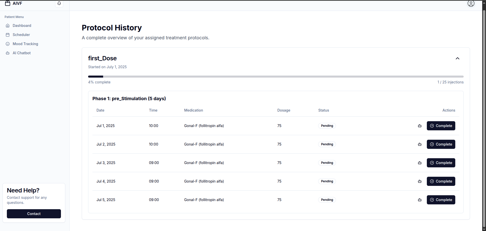
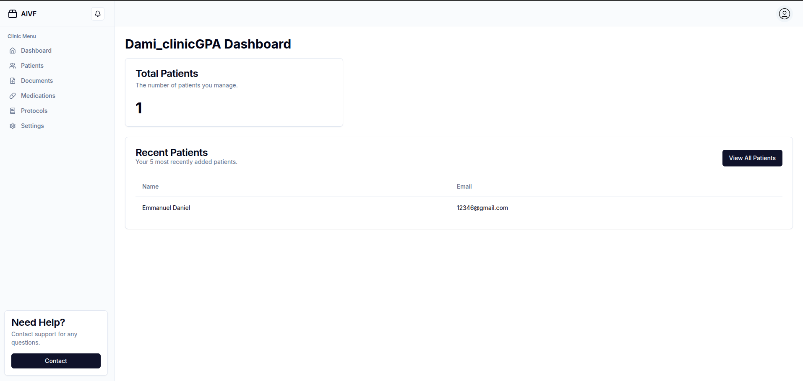
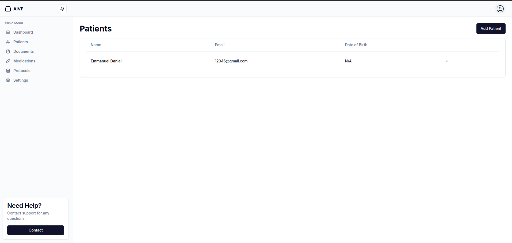
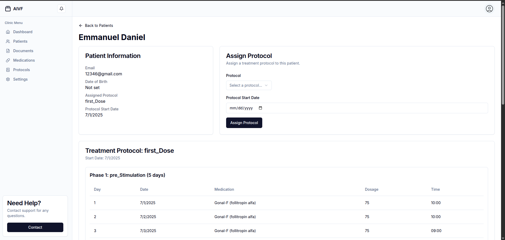
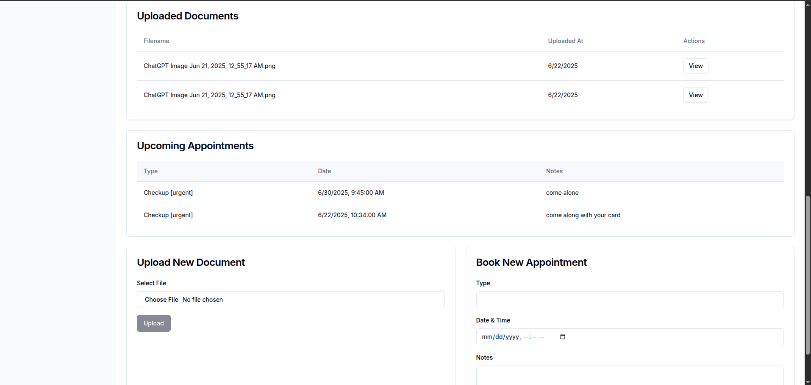
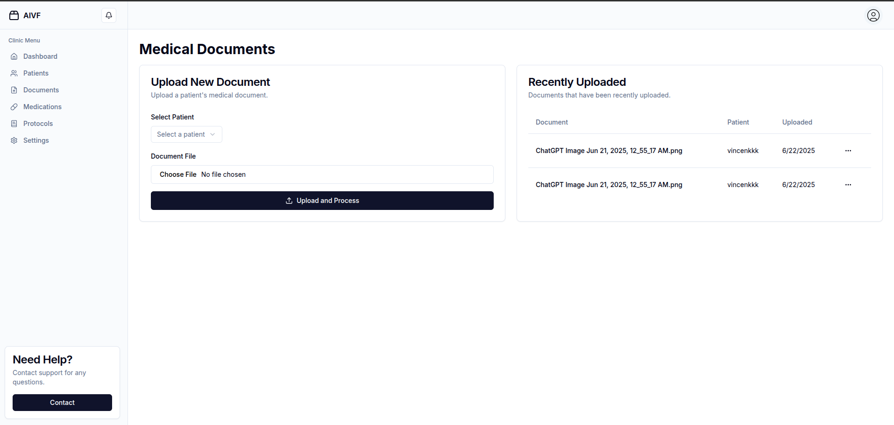

# AIVF: IVF Support & Management Platform

AIVF is a full-stack SaaS application designed to support women undergoing IVF (In Vitro Fertilization) treatment. The IVF process is complex, emotionally taxing, and requires strict adherence to medication schedules. AIVF aims to empower patients and clinics with tools to track, remind, and support every step of the journey.

---

## 🌱 Why AIVF?

IVF is a challenging process:
- Women must self-inject hormones daily, sometimes up to 4 times per day for 16 days.
- The process is overwhelming, with limited day-to-day guidance from medical staff.
- Emotional well-being is often overlooked.
- Emergencies can arise, and quick access to help is crucial.

AIVF addresses these pain points by providing:
- **Personalized injection reminders**
- **Emergency alert system**
- **Mood tracking**
- **AI-powered chatbot for guidance and support**
- **Medical document scanning and organization**
- **Multi-tenant support for clinics and patients**
- **Secure, role-based access**

---

## 🛠️ Tech Stack

- **Frontend & Backend:** Next.js (App Router)
- **Authentication:** NextAuth.js
- **Database:** PostgreSQL (via Prisma ORM)
- **AI Chatbot:** OpenAI + Vector DB (memory)
- **Document Parsing:** OCR
- **Multi-Tenancy:** Data separation by `clinicId`
- **API:** All backend routes in `/app/api`

---

## ✨ Features

- **Clinic Registration & Patient Onboarding**
- **Clinic-only Medical Document Upload & OCR Parsing**
- **AI Chatbot with Memory for Patient Support**
- **Personalized Injection Scheduler & Reminders**
- **Mood Tracking & Patient Dashboard**
- **Emergency Alerts**
- **Role-based Access (Clinic Admin vs. Patient)**
- **Data Isolation for Each Clinic**

---

## 🧑‍💻 Example Prompt to Build the Application

> Build a full-stack IVF SaaS app called AIVF using Next.js (App Router) for both frontend and backend. Use NextAuth.js for auth, Prisma with PostgreSQL for data, and implement multi-tenant access control for clinics and patients. All backend routes should be created as API routes inside /app/api.
>
> This single Next.js app should support:
> - Clinic registration & onboarding patients
> - Clinic-only medical document upload & parsing (OCR)
> - AI-powered chatbot with memory (OpenAI + Vector DB)
> - Personalized injection scheduler
> - Mood tracking, emergency alerts, and patient dashboard
> - Role-based access (clinic admin vs. patient)
> - Data separation by clinicId (multi-tenant)

---

## 🖼️ Demo

### Patient Dashboard

### Patient Document Dashboard

### Patient Mood Tracking Dashboard

### Patient Schedule Dashboard 

### Patient Schedule Dashboard 

### AI Chatbot Support

### clinic Dashboard 

### Clinic All patient Dashboard 

### Clinic single patient Dashboard 

### Clinic Dashboard Upload document

---

## 💡 How AIVF Helps

- **Never miss a dose:** Automated reminders for every injection.
- **Stay supported:** Chatbot answers questions and provides guidance 24/7.
- **Emergency ready:** One-tap emergency alerts for immediate help.
- **Track your journey:** Mood and progress tracking for emotional well-being.
- **All your docs, organized:** Scan and store medical documents securely.

---

## 📦 Getting Started

1. **Clone the repo:**  
   `git clone https://github.com/yourusername/aivf.git`
2. **Install dependencies:**  
   `npm install`
3. **Set up environment variables** (see `.env.example`)
4. **Start Docker (for Postgres):**  
   `docker-compose up -d`
5. **Run database migrations:**  
   `npx prisma migrate deploy`
6. **Run the app:**  
   `npm run dev`

---

## 🤝 Contributing

We welcome contributions! Please open issues or submit pull requests.

---

## 📄 License

MIT

---

